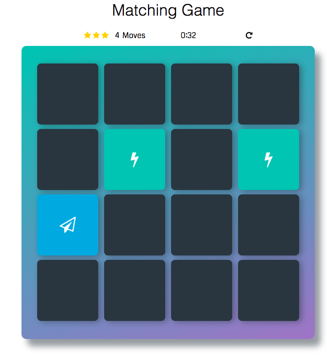

# Memory Game Project
This project is part of the Google/Udacity Nano-degree program.
This is a simple game built to test a users memory. There's a deck of cards with different icons.

## How to play the game:

1- The user should click on those icons to let the card flip.

2- If two cards match they will stay opened and if they don't match they will flip again and the user have a new trial.

3- There is a star rating system on the game which decrease astar according to the number of moves the user takes.

4- There is a time and moves counter.

5- The user could restart the game from the start button and the cards then will be shuffled again.

6- When all cards are opened and have their match then the user wins and will display a message on the screen telling him his star rating and number of moves he took to win the game and also how much time he spent to win, then he may choose to play again or not.
